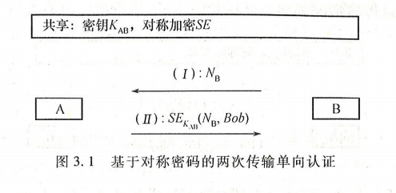
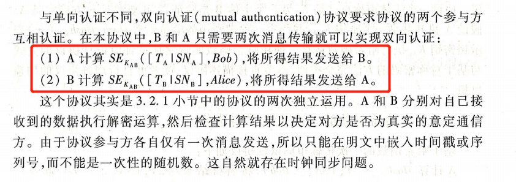

# 实体认证协议

###### 实体认证与身份识别

|          | 实体认证                           | 身份识别                   |
| -------- | ---------------------------------- | -------------------------- |
| 概念     | 验证声称的身份                     | 申明身份                   |
| 抵抗攻击 | 只能抵御来自外部的威胁             | 可以考虑抵御来自内部的攻击 |
| 使用场景 | 结合密钥交换，产生认证过的会话密钥 | 一般不考虑具体目的         |

#### 基于密码的实体认证

* 基于对称密码的两次传输单向认证

* 基于对称密码的两次传输双向认证

* 基于对称密码的三次传输双向认证

#### 基于哈希函数的实体认证

* 基于哈希函数的一次传输单向认证
* 基于哈希函数的二次传输单向认证
* 略

#### 基于公钥密码体制的实体认证

* 略

---

#### 对实体认证的攻击

* 消息重放攻击
* 中间人攻击
* 平行会话攻击
* 反射攻击
* 交错攻击
* 类型攻击