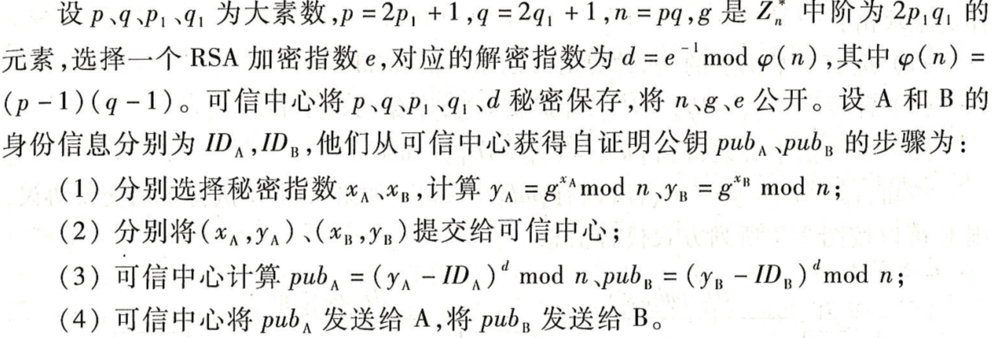
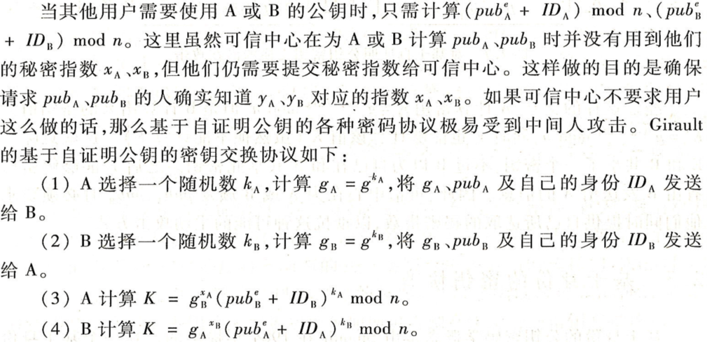
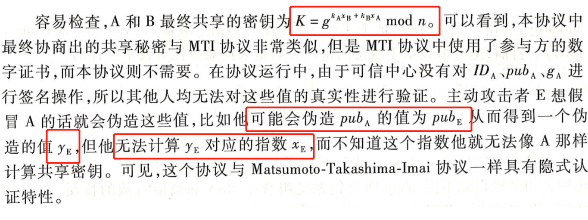

# 密码学概述 & 密钥交换协议

#### 密码学概述

###### 通信中的参与者

* 发送者(Alice)：在双方交互中合法的信息发送实体；
* 接收者(Bob)：在双方交互中合法的信息接收实体；
* 分析者 / 攻击者(Eve)：破坏通信接收和发送双方正常安全通信的其它实体。

###### 信道

* 信道：从一个实体向另一个实体传递信息的通路
* **安全信道**：攻击者没有能力对其上的信息进行阅读、删除、修改、添加的信道
* **非安全信道**：攻击者可以窃听，但不能篡改通信内容，也叫**认证信道**
* **公共信道**：攻击者对通信网络具有完全的控制权，也叫**未认证信道**

###### 常见攻击形式

* 唯密文攻击：分析者仅仅掌握密文；
* 已知明文攻击：分析者掌握密文以及其对应的明文
* 选择明文攻击：分析者可以临时访问加密机，可以 用自己选择的明文加密，但不能直接要求输出密钥；
*  选择密文攻击：分析者可以临时访问解密机，可以解密一些自己想得到的符号串

###### Kerckhoffs准则

* 在评估一个密码系统安全性时，应该总是假定我们的敌人了解实际使用的各种方法，即现代密码学算法应该假设攻击者知道算法的所有执行细节，**算法的安全性依赖于密钥的保密而不是算法的保密**。

###### 密码体制比较

|      | 对称密码               | 非对称密码                                                   |
| ---- | ---------------------- | ------------------------------------------------------------ |
| 优点 | 算法简单，加解密速度快 | 能公开加密密钥，仅需保存解密密钥，不存在密钥管理问题；还能用于消息认证 |
| 缺点 | 不便于密钥管理         | 算法复杂，加解密速度慢                                       |

###### 对认证的常见攻击方法

* 重放攻击
* 平行会话攻击
* 反射攻击
* 交错攻击

###### 数字签名算法必须满足的条件

* 签名者事后不能否认自己的签名
* 其他人不能伪造签名
* 当通信双方为签名真伪发生争执时，可以有第三方解决争端

### 密钥交换协议

#### 基于自证明公钥的密钥交换

* 自证明公钥系统组合了 RSA和离散对数的特点，系统中的用户从可信中心获得一个自证明公钥，但不需要公钥证书，其身份与他的公钥值隐式地相互认证。

  

