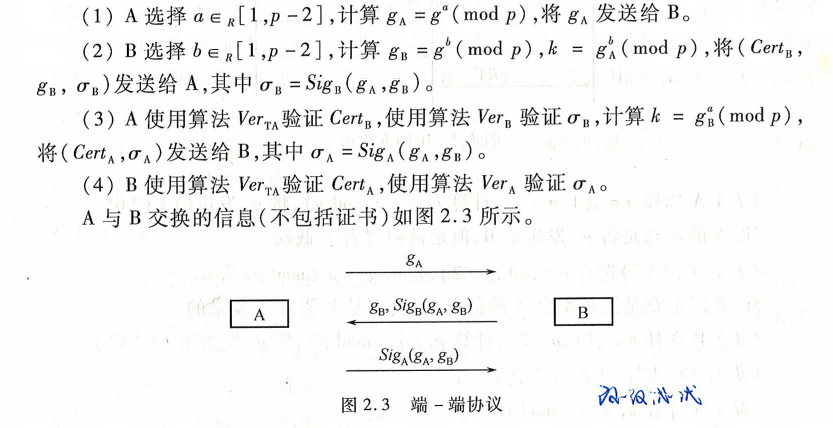
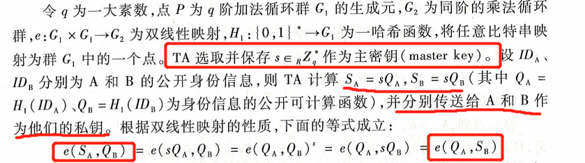
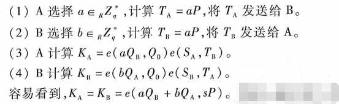
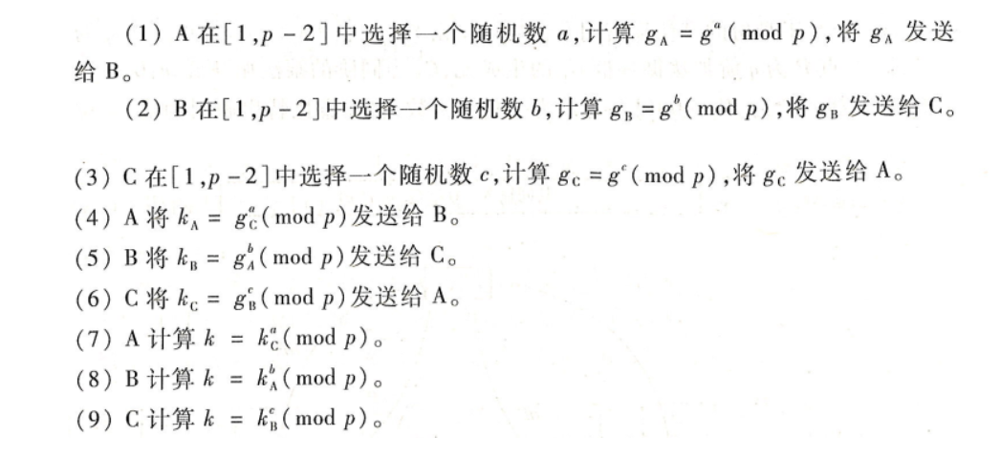
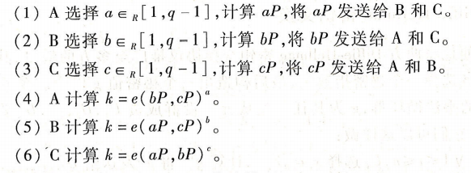
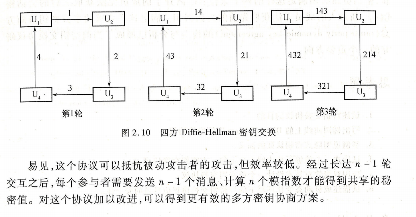

#### 密码学概述

###### 通信中的参与者

* 发送者(Alice)：在双方交互中合法的信息发送实体；
* 接收者(Bob)：在双方交互中合法的信息接收实体；
* 分析者 / 攻击者(Eve)：破坏通信接收和发送双方正常安全通信的其它实体。

###### 信道

* 信道：从一个实体向另一个实体传递信息的通路
* **安全信道**：攻击者没有能力对其上的信息进行阅读、删除、修改、添加的信道
* **非安全信道**：攻击者可以窃听，但不能篡改通信内容，也叫**认证信道**
* **公共信道**：攻击者对通信网络具有完全的控制权，也叫**未认证信道**

###### 常见攻击形式

* 唯密文攻击：分析者仅仅掌握密文；
* 已知明文攻击：分析者掌握密文以及其对应的明文
* 选择明文攻击：分析者可以临时访问加密机，可以 用自己选择的明文加密，但不能直接要求输出密钥；
*  选择密文攻击：分析者可以临时访问解密机，可以解密一些自己想得到的符号串

###### Kerckhoffs准则

* 在评估一个密码系统安全性时，应该总是假定我们的敌人了解实际使用的各种方法，即现代密码学算法应该假设攻击者知道算法的所有执行细节，**算法的安全性依赖于密钥的保密而不是算法的保密**。

###### 密码体制比较

|      | 对称密码               | 非对称密码                                                   |
| ---- | ---------------------- | ------------------------------------------------------------ |
| 优点 | 算法简单，加解密速度快 | 能公开加密密钥，仅需保存解密密钥，不存在密钥管理问题；还能用于消息认证 |
| 缺点 | 不便于密钥管理         | 算法复杂，加解密速度慢                                       |

###### 对认证的常见攻击方法

* 重放攻击
* 平行会话攻击
* 反射攻击
* 交错攻击

###### 数字签名算法必须满足的条件

* 签名者事后不能否认自己的签名
* 其他人不能伪造签名
* 当通信双方为签名真伪发生争执时，可以有第三方解决争端

### 密钥交换协议

###### 会话密钥

* 在安全协议成功运行完毕后，主体间进行应用层会话时使用的密钥，使用时间较短

###### 长期密钥

* 与会话密钥相对应，可以长时间多次使用，可能是共享的对称密钥，也可能是公开密钥系统中的公钥或私钥

###### 抵御重放攻击的方式

*  保证新鲜性：时戳、询问-应答（随机数 ）

#### Diffie-Hellman密钥交换

* 通常情况下，使用这种方法生成的密钥k不会直接用作会话密钥，而是会经过一个哈希计算后获得的输出 H(k) 作为会话密钥

#### DH密钥交换协议中间人攻击

* 攻击形成原因：协议本身不具有**认证**功能

#### 端到端协议：抵御中间人攻击

* 对DH协议进行改进，添加认证机制，以抵御中间人攻击

#### 基于自证明公钥的密钥交换

* 组合了 RSA和离散对数的特点，用户从可信中心获得一个自证明公钥，但不需要公钥证书，其**身份**与的**公钥值**隐式地相互认证。

#### 基于身份的密钥交换:

* 用户的**公开身份信息**就是其公钥，私钥由系统的**私钥生成器TA**生成，绝大部分基于身份的密码方案是采用双线性对技术设计

##### 双线性映射

* 设 q 为一大素数，点**P**为 q 阶加法循环群G1的生成元，G2为同阶的乘法循环群。我们将具有**双线性性**、非退化性、**计算有效性**的函数 e : G×G→G2 称为一个**双线性映射** (bilinear map), 也称双线性配对或**双线性对**(bilinear pairing):

##### 基于身份的非交互密钥分配

* 利用双线性映射的双线性性
* 离线进行，AB之间不直接交互

* 此方法**局限性**：
  * 通信双方得到的共享密钥是**静止**的，但许多应用的每次会话需要新鲜的会话密钥
  * 通信**双方**必须在系统注册并得到自己的私钥才能通信

##### 基于身份的两方密钥交换

* Smart协议：点**P**为 q 阶加法循环群G1的生成元，G2为同阶的乘法循环群。

  

  * KAB的值不仅与参与者的公钥有关，而且是静态的
  * **双线性配对函数**值的计算比**椭圆曲线群**中点的数量乘法**耗时多的多**，因此应让双线性配对个数越少越好

* Smart协议改进版：

  

#### 群组密钥交换

##### 三方 Diffie-Hellman密钥交换

* 利用乘法循环群的可交换性
* 无法抵御中间人攻击

##### 基于双线性配对的三方密钥交换

* 仅需交互一轮
* 同样无法抵御中间人攻击

##### 多方DH密钥交换

