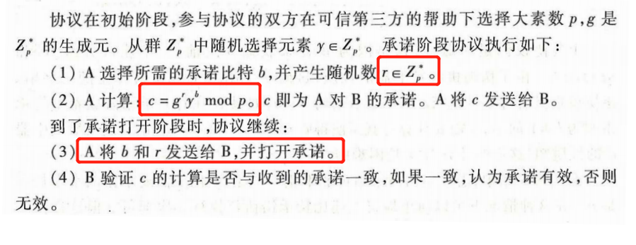
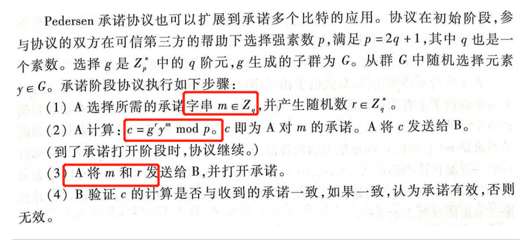

# 比特承诺

#### 基本思想

* 发送者 Alice 向接收者 Bob 承诺一个比特b，要求：
  * 在第 1 阶段即**承诺阶段** Alice 向 Bob 承诺这 个比特b，但是 Bob 无法知道b 的信息；
  * 在第 2 阶段即**打开阶段** Alice 向 Bob 证实她在第 1 阶段承诺的确实是b，但是 Alice 无法欺骗 Bob（即不能在第 2 阶段篡改b 的值）。

#### 两个阶段

* 承诺阶段（commit）：发送方A选择一个要承诺的比特b（b=0或b=1），并把能表示该比特的信息c发给B；
* 打开阶段（open）：A把打开承诺的消息d和b发送给B，并用d打开c并验证b是否是A承诺的比特。

#### 安全性质

* 隐藏性：第一阶段结束时，B得不到A承诺的比特b的值，即使一个不诚实的接收方也要满足这个条件；
* 绑定性：发送者不能再打开承诺阶段改变自己承诺的比特。

#### 注记

* 比特承诺对于**验证者**是有些不公平的：承诺者对于b给出承诺c之后，验证者只是接收到了c，要等到承诺者打开承诺，验证者才能知道承诺内容；如果**承诺者拒绝打开承诺**，则验证者什么也不能得到。对于**2个参与者**的密码协议来说，这种不公平性**无法避免**，因为另一个参与者可以能够再协议输出之前退出协议，使得自己获得稍许优势。

#### 常用比特承诺协议

##### 使用对称加密函数

* 承诺阶段B发送随机串，A发送密文；打开阶段A发送密钥

##### 使用单向散列函数：

* 相比之前，优点在于**B不用发送任何消息**

​			

##### 使用伪随机数发生器

* 在B获取s或b前，不能区分**G(s)**和**G(s)异或R**的值，满足**隐藏性**
* 若A想要在承诺阶段改变b的值，需要找到s'满足c'值与原c值相等，由于伪随机数发生器的性质，这是计算困难的，满足**绑定性**
* 在实际应用中，可能需要承诺长度为n的字串，将上述比特承诺执行n次即可，但这样效率太低，可改为如下形式

##### Pedersen 承诺协议

* 利用**离散对数**问题构造

* 扩展为多比特承诺：

  

#### 比特承诺的应用

* 电子竞拍
* 公平的抛硬币协议（两人无法见面的情况下，见面直接抛就好了......）