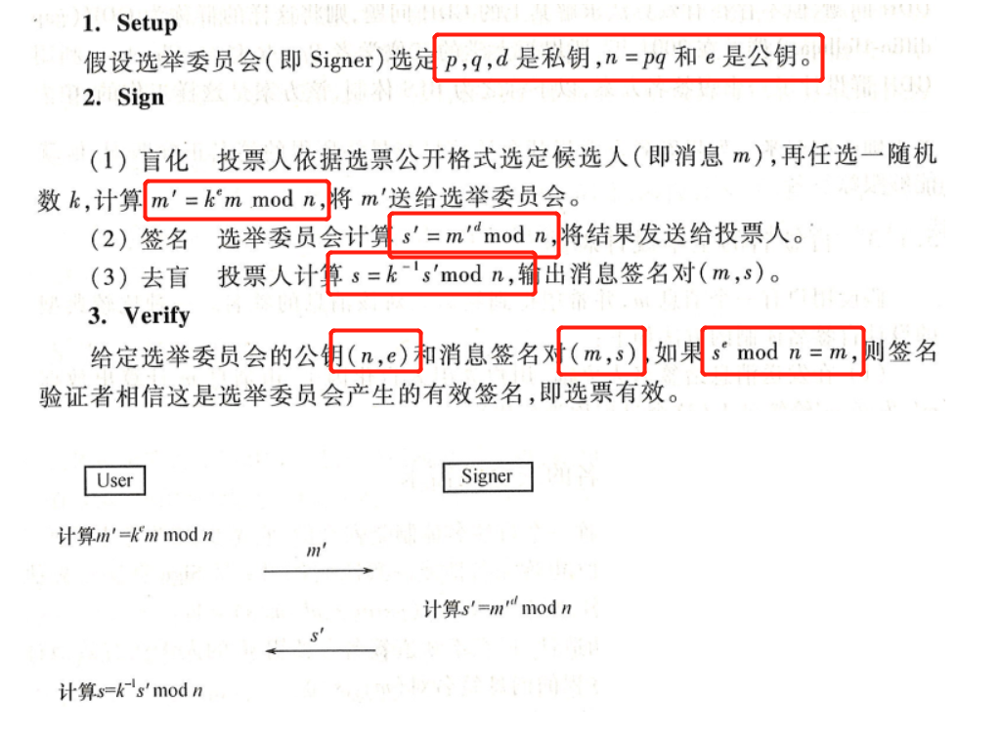
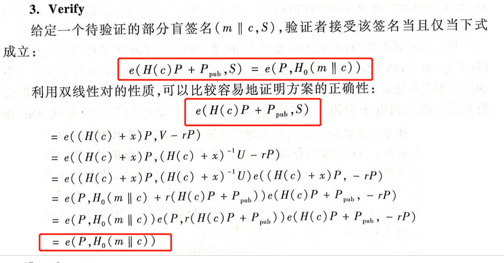
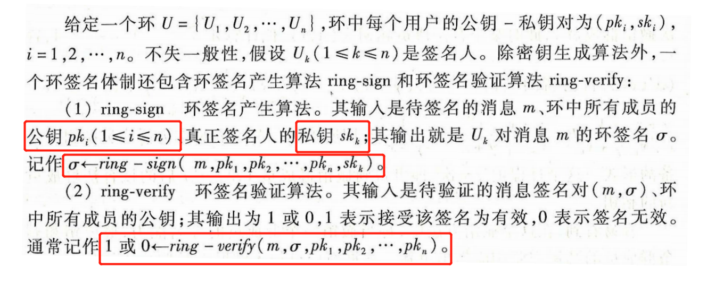
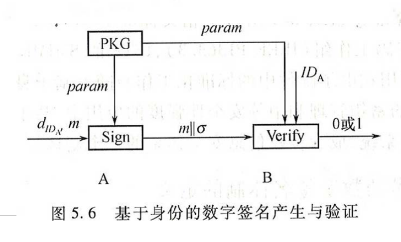

# 高级签名协议

#### 数字签名

#### 盲签名

##### 盲签名概念

* 如果协议正确执行，持有消息**m**的用户User可以获得签名人**Signer**对消息m的数字签名**s**，但**Signer**不知道**m**的内容，即使之后公开**（m,s）**也无法追踪之前签名的过程

##### 盲签名体制三个算法

- Setup：输出系统参数和签名人公私钥对**（pk, sk）**
- Sign：用户秘密输入待签名消息**m**，签名人秘密输入自己的私钥**sk**，执行签名协议，在多项式时间内停止，输出签名**s**
- Verify：输入签名人公钥pk以及待验证消息签名对**（m,s）**，验证签名有效性

##### 三个性质

- 正确性：消息签名对合法
- 不可伪造性：任意不知道签名人私钥的人无法构造合法的消息签名对
- 盲性：除了请求签名的用户外，任何人都无法将交互协议产生的会话消息与最终的盲签名正确匹配。

##### 基本设计思路

- 盲化：发送消息给签名人之前，用户先引入盲化因子，由消息m计算m'，发送m'给签名人
- 签名：签名人对m'签名得到s'，发回给用户
- 去盲：用户从s'中计算消息m的签名s

##### 基于RSA问题的盲签名

* 投票人使用**随机数**对选票m进行了盲化操作

##### 基于离散对数的盲签名

* 若一个素数阶群上存在有效算法求解DDH问题，但无法求解CDH问题，称这样的群为GDH群；
* 基于**GDH群**，设计了一个**短签名方案BLS**

##### 部分盲签名

* 普通盲签名体制中，被签名的消息完全由用户控制，签名人对此一无所知，也不知道关于最终签名的任何信息，可能会导致签名被非法使用
* 部分盲签名体制中，签名人可在签名中嵌入一个和用户事先约定好的**公共信息**。可应用于电子现金方案。

​	双线性对设计的部分盲签名：

* **Setup**

  

* **Sign**

  

* **Verify**

  

#### 群签名

##### 群签名概念

* 群体中的成员可代表整个群体进行匿名签名。
* 群签名方案中一般包含群管理员和群成员
  * **群管理员**：负责生成系统参数、群公钥、群私钥，为群成员产生签名私钥或群成员身份证书，在发生争端的情况下能从给定的群签名中识别出产生该签名的群成员
  * **群成员**：用自己掌握的签名私钥代表整个群执行签名操作

##### 群签名算法组成：

- 系统初始化算法：产生群公钥、群成员公钥和私钥、群管理员用于打开签名的私钥
- 成员加入：新用户通过和群管理员的交互协议请求加入，协议执行结束后，新成员完成注册并获得一个秘密密钥
- 签名：用群成员的私钥和群成员资格证书对消息m进行签名
- 验证：验证消息m的签名是否为合法签名
- 打开：管理员使用消息、消息的签名、自己的私钥，揭示签名者真实身份

##### 安全性需求

- 正确性：合法的群成员产生的消息签名对一定能通过验证
- 不可伪造性
- **匿名性**：验证者只能确定签名由群体中的某个成员产生，但不能确定是哪个成员
- 无关联性：在不打开签名的情况下，确定两个不同的群签名是一个人签是不可能的
- **可追踪性**：在必要情况下，群管理者可以打开
- 防陷害性：包括群管理员在内的任何成员都不可以以其他群成员的名义产生合法群签名
- 抗联合攻击：任意多个群成员勾结或与群管理员勾结都不能伪造其他群成员签名

##### 简单群签名方案一

群有n个人，管理员为GM

- 系统初始化：GM为群众每个成员分发一张秘密密钥表，这些表互不相交，GM将各成员拥有的私钥汇总到一起，将这些私钥对应的公钥以随机次序排成一张表，并公开公钥表
- 签名：群成员每次从自己的私钥表中选择一个没用过的私钥进行签名
- 签名验证：验证者对每个公钥表中的公钥进行验证，若有一个通过，则为合法
- 打开：群管理者知道所有私钥和公钥间的关系，可以根据签名、公钥恢复签名人身份

##### 成员撤销

* 常用成员撤销方法：群管理者发布一个**身份撤销列表**
* 每当撤销一个群成员，根据群公钥或群成员私钥是否发生变化，可将群签名方案分为**动态**群签名（无需变化）和**静态**群签名（需要变化）

##### 动态群签名和静态群签名

| 签名类型   | 性质                                 |
| ---------- | ------------------------------------ |
| 动态群签名 | 撤销成员时，群公私和成员私钥不变化   |
| 静态群签名 | 撤销成员时，需要更新群公钥和成员私钥 |

#### 环签名

##### 环签名概念

* 假设环有**n**个人，签名人可用自己的私钥和其他**n-1**个人的公钥执行环签名操作产生签名**(m,s)**，验证者执行验证算法，若签名有效则可确信该签名由环中某人产生，但不可识别是哪个人产生。

##### 环签名的安全性需求（只要满足前三点就是安全的）：

- 正确性
- 不可伪造性
- 匿名性：给定环签名，任意验证者无法确认该签名的真正签名人
- 可链接性：部分环签名的**特殊性质**，若某签名人产生了两个消息签名对，则存在有效算法确认这两个消息是环中同一签名人产生（但不知道是哪一个）

具有可链接性的环签名还有一个**签名链接算法link**，可判断签名是否由同一环成员生成

#### 群签名与环签名区别

|          | 群签名                                      | 环签名                   |
| -------- | ------------------------------------------- | ------------------------ |
| 管理员   | 有                                          | 无                       |
| 可跟踪性 | 有                                          | 无                       |
| 可链接性 | 无                                          | 有                       |
| 签名密钥 | 简单群签名：一个私钥； SGS：私钥与公钥 | 自己的私钥和其他人的公钥 |

#### 基于身份的数字签名

* 将用户的**公开身份信息**或根据身份信息利用算法计算出的结果作为用户公钥，用户私钥由**密钥生成器PKG**生成并安全地发送给用户。
* 相对于传统的PKI技术，无需复杂的公钥证书与认证
* 基于身份的数字签名体制IBS通常包含四部分：**IBS=（Setup，Extract，Sign，Verify）**

