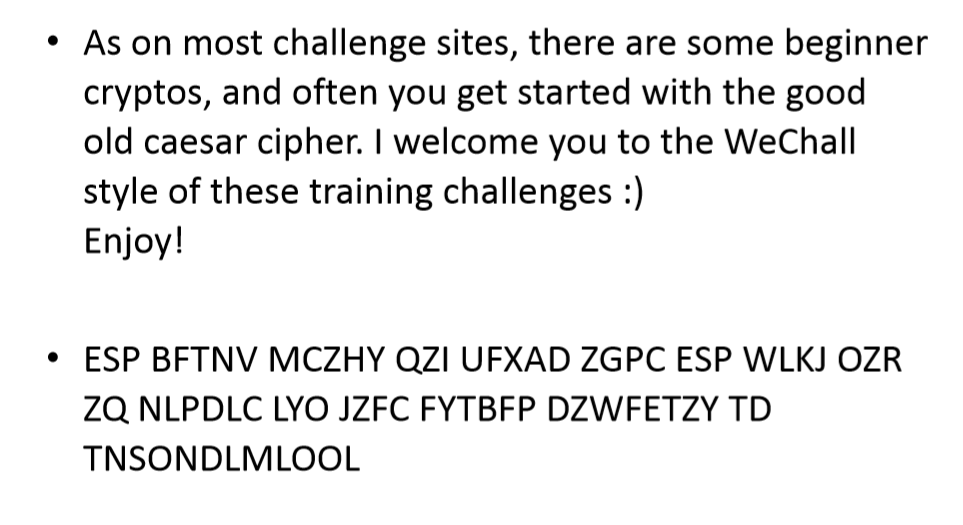
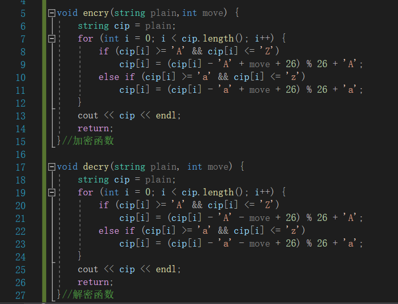
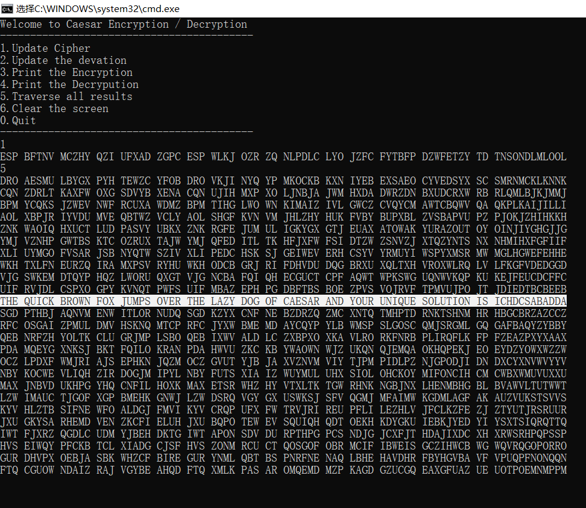

### 密码学第一次作业



加密方式：凯撒加密

密文：$ESP\ BFTNV\ MCZHY\ QZI\ UFXAD\ ZGPC\ ESP\ WLKJ\ OZR\\ ZQ\ NLPDLC\ LYO\ JZFC\ FYTBFP\ DZWFETZY\ TD\ TNSONDLMLOOL$

解密脚本：$caesar.cpp$

脚本功能：实现特定位数的凯撒加密/解密，同时也能实现遍历凯撒加密；进行输入检测，遇到非法输入时即时中止程序。

解密结果：$THE\ QUICK\ BROWN\ FOX\ JUMPS\ OVER\ THE\ LAZY\ DOG\\ OF\ CAESAR\ AND\ YOUR\ UNIQUE\ SOLUTION\ IS\ ICHDCSABADDA$

关键函数截图：



实验截图：




程序完整代码：$caesar.cpp$

```C++
#include <iostream>
#include<string>
using namespace std;

void encry(string plain,int move) {
	string cip = plain;
	for (int i = 0; i < cip.length(); i++) {
		if (cip[i] >= 'A' && cip[i] <= 'Z')
			cip[i] = (cip[i] - 'A' + move + 26) % 26 + 'A';
		else if (cip[i] >= 'a' && cip[i] <= 'z')
			cip[i] = (cip[i] - 'a' + move + 26) % 26 + 'a';
	}
	cout << cip << endl;
	return;
}//加密函数

void decry(string plain, int move) {
	string cip = plain;
	for (int i = 0; i < cip.length(); i++) {
		if (cip[i] >= 'A' && cip[i] <= 'Z')
			cip[i] = (cip[i] - 'A' - move + 26) % 26 + 'A';
		else if (cip[i] >= 'a' && cip[i] <= 'z')
			cip[i] = (cip[i] - 'a' - move + 26) % 26 + 'a';
	}
	cout << cip << endl;
	return;
}//解密函数

int main() {
	string cipher = "NULL";	//待解密字符串
	int chos;		//选择模式
	int move = 0;		//偏移量

	cout << "Welcome to Caesar Encryption / Decryption" << endl;
	cout << "------------------------------------------" << endl;
	cout << "1.Update Cipher\n2.Update the devation\n3.Print the Encryption\n4.Print the Decrypution\n5.Traverse all results\n6.Clear the screen\n0.Quit" << endl;
	cout << "------------------------------------------" << endl;
	while (true){
		cin >> chos;	//选择模式
		while (cin.fail()) {
			cin.clear();
			cout << "Please input a number!" << endl;
		}//读入非法字符
		char tmp = getchar();//干掉'\n'
		switch (chos){
		case 1: 
			getline(cin, cipher); break;
		case 2:
			cin >> move;
			while (cin.fail()) {
				cin.clear();
				cout << "Please input a number!" << endl;
			}//读入非法字符
			tmp = getchar();//干掉'\n'
			move %= 26;
			break;
		case 3: 
			if ("NULL" == cipher) {
				cout << "Please input Cipher first!" << endl;
				break;
			}
			encry(cipher, move);
			break;
		case 4: 
			if ("NULL" == cipher) {
				cout << "Please input Cipher first!" << endl;
				break;
			}
			decry(cipher, move);
			break;
		case 5: 
			for (int i = 1; i < 26; i++)
				decry(cipher, i);
			break;
		case 6:
			system("cls");
			//system("clear");
			cout << "------------------------------------------" << endl;
			cout << "1.Update Cipher\n2.Update the devation\n3.Print the Encryption\n4.Print the Decrypution\n5.Traverse all results\n6.Clear the screen\n0.Quit" << endl;
			cout << "------------------------------------------" << endl;
			break;
			
		case 0:
			cout << "Bye~" << endl;
			system("pause");
			return 0;
		default:
			break;
		}
	}
	return 0;
}
```

